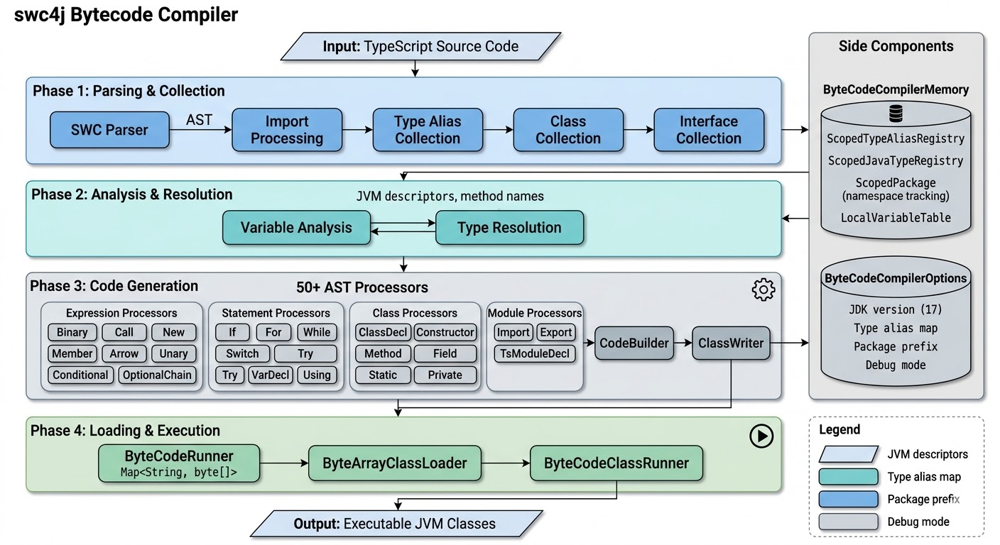

# TypeScript to JVM Bytecode Compiler

## Overview

The TypeScript to JVM Bytecode Compiler is an experimental feature in swc4j that compiles TypeScript-like code directly into Java 17 bytecode. This allows you to write TypeScript-style code that executes as native Java classes on the JVM, combining TypeScript's syntax with Java's type system and performance.

## What is This Feature?

This feature provides a compiler that:

- **Parses TypeScript-like syntax** using SWC's parser
- **Performs type inference** on variables and expressions
- **Generates JVM bytecode** that can be loaded and executed directly
- **Supports Java primitive types** (`int`, `long`, `float`, `double`, `char`, `short`, `byte`, `boolean`) and their wrapper types (`Integer`, `Long`, `Float`, `Double`, `Character`, `Short`, `Byte`, `Boolean`)
- **Enables type annotations** on variables, parameters, and return types
- **Compiles classes, methods, constructors, fields, and expressions** into executable Java classes

### Key Capabilities

**Classes and Objects:**
- Compile TypeScript namespaces to Java packages (including nested namespaces)
- Compile TypeScript classes to Java classes
- Class inheritance (`extends`) with method overriding and `super` calls
- Implement Java interfaces (`implements`) via `import { Runnable } from 'java.lang'` or type alias maps
- Abstract classes and methods
- Constructors with parameter properties (`constructor(public x: int)`)
- Constructor overloading and chaining (`this(...)`)
- Method overloading (same name, different parameter types/arity)
- Static fields, methods, and static initialization blocks
- Private methods and fields (ES2022 `#method` syntax)
- Class fields with initializers
- Access modifiers (`public`, `private`, `protected`)
- Generics (basic support)
- Extend Java standard library classes (e.g., `java.util.ArrayList`, `java.lang.Exception`)
- Cross-namespace class instantiation with qualified names (`new com.math.Adder()`)

**Functions:**
- Standalone functions (compiled to static methods in a default `$` class)
- Method parameters with type annotations
- Default parameter values (compiled to method overloads)
- Varargs parameters
- Recursion and mutual recursion
- Arrow functions and closures

**Type System:**
- Type inference for variables and expressions
- Explicit type annotations with Java types
- Primitive types and wrapper types (boxing/unboxing)
- Type aliases (`type MyInt = int` or via `typeAliasMap`)
- Import Java types with `import { ArrayList } from 'java.util'`
- `as` type assertions

**Control Flow:**
- `if` / `else if` / `else`
- `while` and `do-while` loops
- `for` loops (C-style, `for-in`, `for-of`)
- `switch` statements
- `try` / `catch` / `finally`
- `break` and `continue`
- `throw`

**Expressions:**
- Arithmetic operators (`+`, `-`, `*`, `/`, `%`)
- Comparison operators (`==`, `!=`, `<`, `>`, `<=`, `>=`, `===`, `!==`)
- Logical operators (`&&`, `||`, `!`)
- Bitwise operators (`&`, `|`, `^`, `~`, `<<`, `>>`, `>>>`)
- Unary operators (`-`, `+`, `!`, `~`, `++`, `--`)
- Assignment operators (`=`, `+=`, `-=`, `*=`, `/=`, etc.)
- Conditional (ternary) operator (`? :`)
- String concatenation
- Template literals
- Tagged template literals
- Optional chaining (`?.`)
- `new` expressions with qualified names
- Member expressions and method calls

**Literals:**
- Numbers (`int`, `long`, `float`, `double`)
- Strings (basic, escape sequences, character literals)
- Booleans (`true`, `false`)
- `null`
- BigInt
- Regular expressions
- Arrays
- Objects
- Template literals

**TypeScript-Specific:**
- TypeScript interfaces compiled to Java interfaces
- Interface property declarations generate abstract getter/setter methods
- Interface extends (single and multiple)
- TypeScript enums compiled to Java enums
- `using` declarations (resource management)
- Destructuring patterns (array, object, rest)

### Current Limitations

- **Experimental**: This is an active development feature
- **JDK 17 only**: Currently targets Java 17 bytecode
- No async/await
- Limited generic type parameter support at runtime (type erasure)

## Usage

### Quick Start

```java
import com.caoccao.javet.swc4j.compiler.*;

// Create a compiler targeting JDK 17
ByteCodeCompiler compiler = ByteCodeCompiler.of(
        ByteCodeCompilerOptions.builder()
                .jdkVersion(JdkVersion.JDK_17)
                .build());

// Compile a TypeScript function
ByteCodeRunner runner = compiler.compile("""
        export function add(a: int, b: int): int {
          return a + b
        }""");

// Invoke the compiled function
ByteCodeClassRunner classRunner = runner.createStaticRunner("$");
int result = classRunner.invoke("add", 1, 2);
// result == 3
```

### Classes and Namespaces

```typescript
namespace com {
  export class Calculator {
    add(a: int, b: int): int { return a + b }
    multiply(a: double, b: double): double { return a * b }
  }
}
```

```java
ByteCodeRunner runner = compiler.compile(code);
ByteCodeClassRunner classRunner = runner.createInstanceRunner("com.Calculator");
int sum = classRunner.invoke("add", 3, 4);       // 7
double product = classRunner.invoke("multiply", 2.5, 4.0);  // 10.0
```

### Inheritance and Interfaces

```typescript
import { Runnable } from 'java.lang'

namespace com {
  export abstract class Shape {
    abstract area(): double
  }
  export class Circle extends Shape implements Runnable {
    radius: double
    constructor(r: double) {
      this.radius = r
    }
    area(): double { return 3.14159 * this.radius * this.radius }
    run(): void { }
  }
}
```

### TypeScript Interfaces

```typescript
namespace com {
  export interface Named {
    name: String
  }
  export interface Aged {
    age: int
  }
  export interface Person extends Named, Aged {
    greet(): String
  }
  export class Student implements Person {
    name: String = ""
    age: int = 0
    constructor(name: String, age: int) {
      this.name = name
      this.age = age
    }
    getName(): String { return this.name }
    setName(name: String): void { this.name = name }
    getAge(): int { return this.age }
    setAge(age: int): void { this.age = age }
    greet(): String { return this.name + " (" + this.age + ")" }
  }
}
```

### Extending Java Classes

```typescript
namespace com {
  export class MyList extends java.util.ArrayList<Object> {
    addItem(item: String): void {
      this.add(item)
    }
    getCount(): int {
      return this.size()
    }
  }
}
```

### Type Alias Map

```java
ByteCodeCompiler compiler = ByteCodeCompiler.of(
        ByteCodeCompilerOptions.builder()
                .jdkVersion(JdkVersion.JDK_17)
                .typeAliasMap(Map.of(
                        "int", "int",
                        "void", "void",
                        "String", "java.lang.String",
                        "Runnable", "java.lang.Runnable"))
                .build());
```

Note: calling `typeAliasMap()` on the builder **replaces** the default aliases (which include primitives, `String`, `Object`, etc.), so include all types the code needs.

### Package Prefix

```java
ByteCodeCompiler compiler = ByteCodeCompiler.of(
        ByteCodeCompilerOptions.builder()
                .jdkVersion(JdkVersion.JDK_17)
                .packagePrefix("com.mycompany")
                .build());
```

## Technical Design

### Architecture

The compiler follows a **multi-phase compilation pipeline**:



### Core Components

#### ByteCodeCompiler

The main entry point:

- `ByteCodeCompiler.of(options)`: Factory method to create a compiler
- `compile(String code)`: Compiles TypeScript code, returns `ByteCodeRunner`

#### ByteCodeRunner

Wraps the compiled bytecode and provides class loading:

- `createInstanceRunner(className, constructorArgs...)`: Create an instance and invoke methods
- `createStaticRunner(className)`: Invoke static methods
- `getClass(className)`: Get the loaded `Class<?>` object
- `getDefaultClass()`: Get the default `$` class

#### ByteCodeClassRunner

Wraps a loaded class for method invocation:

- `invoke(methodName, args...)`: Invoke a method with automatic parameter matching
- `getInstance()`: Get the underlying object instance

#### ASM Layer

Low-level bytecode generation:

- **ClassWriter**: Generates JVM class file structure (constant pool, methods, fields, attributes)
- **CodeBuilder**: Fluent API for JVM bytecode instructions

#### Processors (50+)

Specialized processors for each AST node type:

- **Expression Processors**: ArrayLiteral, Arrow, Assign, Binary, Call, Conditional, Function, Member, New, Unary, Update, OptionalChain, etc.
- **Statement Processors**: If, For, ForIn, ForOf, While, DoWhile, Switch, Try, Throw, Break, Continue, VarDecl, Using, etc.
- **Class Processors**: Class, ClassDecl, ClassMethod, ClassExpr, PrivateMethod, Constructor
- **Module Processors**: ImportDecl, ExportDecl, TsModuleDecl
- **Type Processors**: TypeResolver, VariableAnalyzer, TypeAliasCollector, ClassCollector, EnumCollector, TsInterfaceCollector

### Type System

**Primitive Types:**

| Type | JVM Descriptor | Size |
|------|---------------|------|
| `boolean` | Z | 1 byte |
| `byte` | B | 1 byte |
| `char` | C | 2 bytes |
| `short` | S | 2 bytes |
| `int` | I | 4 bytes |
| `long` | J | 8 bytes (2 slots) |
| `float` | F | 4 bytes |
| `double` | D | 8 bytes (2 slots) |

**Wrapper Types:** `Boolean`, `Byte`, `Character`, `Short`, `Integer`, `Long`, `Float`, `Double`, `String`, `Object`, `Number`

**Type Inference:**
- Integer literals → `int`
- Decimal literals → `double`
- String literals → `String`
- Boolean literals → `boolean`
- `null` → `Object`
- Variables → lookup in inferred types map
- `new` expressions → class type
- Method calls → return type from registry or reflection

**Type Conversions:**
- Explicit annotations override inference (e.g., `const a: float = 123.456`)
- Automatic boxing/unboxing for wrapper types
- Primitive widening conversions (int → long, float → double)
- String concatenation via `StringBuilder`

## Testing

The compiler has 259 test files covering:

| Category | Count | Covers |
|----------|-------|--------|
| Class tests | 15+ | Basic, inheritance, constructors, fields, static, private, abstract, generics, implements, nested |
| Function tests | 9 | Basic, params, return types, inference, overloading, default params, varargs, without class |
| Arrow functions | 16 | Basic, body, closure, params, destructuring, generic, IIFE, nested, type inference |
| Binary expressions | 28 | Add, Sub, Mul, Div, Mod, bitwise, logical, comparison, shifts |
| Statements | 55+ | If/else, while, do-while, for, for-in, for-of, switch, try-catch, using, debugger |
| Literals | 30+ | Numbers, strings, booleans, null, BigInt, regex, arrays, objects, templates |
| TypeScript | 15+ | Interfaces, enums, type coverage, expressions |
| Other | 20+ | Patterns, optional chaining, super props, class expressions, conditional, unary, update |

## Tutorials

See the [Bytecode Compiler tutorials](tutorials/README.md) for a progressive guide from basics to advanced features.

## Troubleshooting

### Swc4jByteCodeCompilerException

If you get a compilation exception:
- **"Unresolved type"**: Import the type with `import { X } from 'java.pkg'` or register it in `typeAliasMap`
- **"Cannot infer return type"**: Add an explicit return type annotation to the method
- **"Method not found"**: Check parameter types match the method signature

### VerifyError

If you get a `VerifyError` at runtime:
- Incorrect bytecode generation (wrong instruction sequence)
- Type mismatch (e.g., trying to `freturn` when method returns `int`)
- Stack imbalance (wrong max stack size)

### ClassCastException

If you get a `ClassCastException` when invoking methods:
- Method returns wrong type — ensure type annotations match expected types

## Performance

- **Compilation time**: Parsing and bytecode generation add overhead
- **Runtime performance**: Generated bytecode runs at native JVM speed (same as compiled Java)
- **Memory**: Each compiled class consumes memory for bytecode and loaded class metadata

For production use, consider:
- Caching compiled `ByteCodeRunner` instances
- Using a custom parent ClassLoader for class unloading
- Monitoring memory usage

## Conclusion

The TypeScript to JVM Bytecode Compiler bridges TypeScript syntax and JVM execution. It supports classes, inheritance, interfaces, control flow, constructors, fields, generics, enums, and interoperability with Java standard library classes.

For questions or contributions, please visit the [swc4j GitHub repository](https://github.com/caoccao/swc4j).
